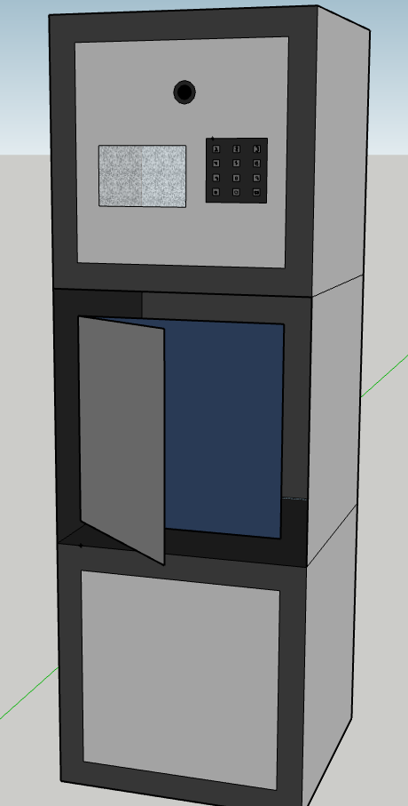
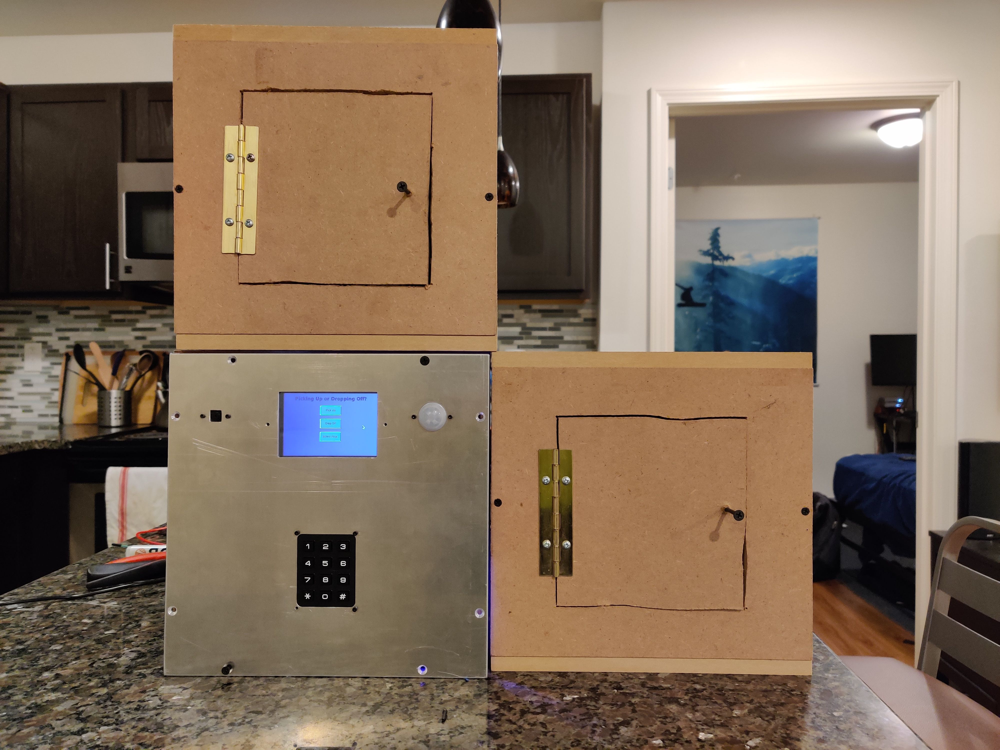

# Modularized Smart Locker

This is the GitHub site for Team 61 in 2021 Fall ECE 445 Senior Design Lab. We designed a modularized smart locker solution to lower the cost of making a smart locker like Amazon Hub Locker while providing a template full-stack solution to manufacturers to produce just 2 modules that can fulfill the various needs for a smart locker. By using 1 control modules and 1-127 locker modules (limited by RS485), we can provide a secure & smart locker solution to household customers and apartment owners.

**[Video Demo](https://www.youtube.com/watch?v=GHPYQF2T6pg)**

## Contributor

- Jack Davis
- Jake Pu
- Josh Nolan

## How to run

### ESP32 on locker module

1. Install ESP-IDF following the [tutorial](https://docs.espressif.com/projects/esp-idf/en/latest/esp32/get-started/).
2. Make sure you run `. $HOME/esp/esp-idf/export.sh`
3. Navigate to `./ESP32/deployment`
4. run `idf.py fullclean`
5. run `idf.py -p PORT flash`, on my Ubuntu laptop, the PORT is `/dev/ttyUSB0` with dev kit and `/dev/ttyACM0` with ESP32-S2-WROVER-I module.
6. **On the module, since RTS is not connected, we have to restart the module with the button on EN ourselves.**

### GUI on RPI

#### Install required library

    pip3 install paramiko scp gpiozero mysql smtplib email RPi ast pad4pi
    pip install mysql

#### Run

    cd ./RPI
    python3 gui.py

## Website

1. Navigate to the Website/server folder.
2. Run `node index.js` in the console.
3. Open a new console.
4. Type `npm start App.js`. It will launch a website in the web browser.

## Lessons Learned

1. Never use EAGLE. KiCAD is way easier.
2. We should expose test points for important signals and all voltage buses.
3. Never use the default TX/RX signal for other purposes. It is how we get the printf statements when debugging.
4. Use USB connector board to minimize the effort needed to solder the USB connector to the PCB (*It is super hard to solder those bad boys.*). USE USB C type instead of USB A type connector since it is 2021.
5. The ^RE and DE of the RS485 transceiver should be connected to the RTS pin of the ESP32 so that the software can take care of the half-duplex mode.
6. Use a diode to protect the circuitry from reverse voltage (people make mistakes all the time T_T).
7. Never use through-hole capacitor again.
8. Measure inputs before we plug everything.
9. Color Coding is critical to reliable testing and developing.
10. Buy a oscilloscope with a logical analyzer feature.
11. Overspec your power supply.

## Problems

1. The [touch screen](https://www.amazon.com/gp/product/B076M399XX) does work in mock demo but failed in final demo. We have no clue why. It might be the driver that we changed (To turn off BT to use `/dev/ttyAMA0` for UART communication with a parity bit; to flip the screen since our monitor is ) or the wiring in our project.
2. Keypad is glitchy. (We think it is also a wiring problem.)
3. Server shut itself down every few minutes.

## To Do

There are few things that we have not done but we think could be done to push this idea to perfection.

- [ ] **Huge and Important Change**: Change UART on RS485 to I2C Differential. I2C is already a very mature protocol that supports multi-master multi-slave mode and handles collision elegantly. Putting I2C on differential signal can deliver signal to at least 3 meters far (much farther given our low bandwidth requirement & matching clock frequency. In this way, we can easily check the delivery status of the messages on the bus. The I2C addressing is also very helpful so that we do not have to do it ourselves. A suggested chip is the [NXP’s PCA9615 IC](https://www.nxp.com/docs/en/data-sheet/PCA9615.pdf).  
- [ ] RPI CPU usage is very high when it is running gui.py. The cpu would overheat and throttle leading to wrong keypad input.
- [ ] Redesign our schematics and PCB so that we do not have to cut the PCB to have a functional circuit.
  - [ ] Redesign schematics
  - [ ] Redesign PCB
